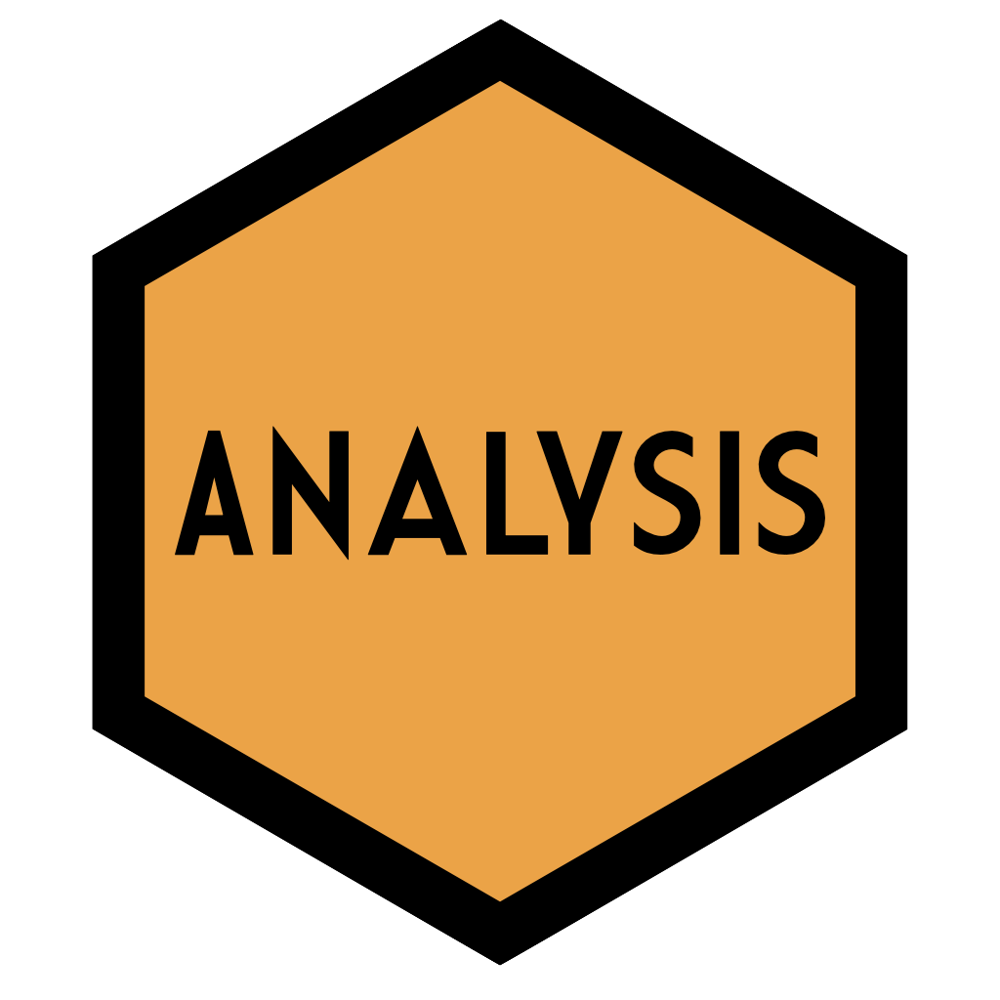
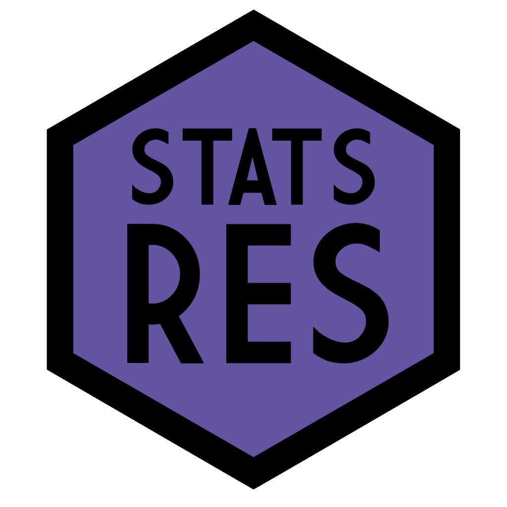

```{r setup, include = FALSE}
source("_R/psyteachr_setup.R")
```

The psyTeachR team at the University of Glasgow [School of Psychology and Neuroscience](https://www.gla.ac.uk/schools/psychologyneuroscience/) has successfully made the transition to teaching reproducible research using R across all undergraduate and postgraduate levels. Our curriculum now emphasizes essential ‘data science’ graduate skills that have been overlooked in traditional approaches to teaching, including programming skills, data visualisation, data wrangling and reproducible reports. Students learn about probability and inference through data simulation as well as by working with real datasets.

This website contains our open materials for teaching reproducible research. See our [GitHub](https://github.com/PsyTeachR) for open data and code.

<!-- no spaces between <a> or % is wonky -->
<div class="hexes">
<div class="hexrow"><a href="/data-skills/"></a><a href="/analysis/"></a><a href="/stat-models/"></a><a href="/quant-fun/"></a><a href="/reprores/"></a><a href="/glossary/"></a><a href="/ads/"></a></div>
<div class="hexrow"><a href="/handyworkbook/"></a><a href="/introdataviz/"></a><a href="/tutorials/"></a><a href="https://debruine.github.io/shinyintro/"></a><a href="/template/"></a><a href="https://psyteachr.github.io/webexercises"></a><a href="https://psyteachr.github.io/markr/"></a><a href="https://debruine.github.io/faux/"></a></div>
</div>


--------------------------

## Course Books

### Undergraduate Series

<div class="level">
<div class="column-left">
<a href="/data-skills/"></a>
</div>

<div class="column-right">

#### [Level 1: Data Skills](/data-skills/)

Our first-year undergraduate course covers current state of psychological science and what Open Science is as well as its importance. It also aims to make students confident and competent at using RStudio as a tool to achieve good data management skills.

Authors: [Emily Nordmann](https://www.gla.ac.uk/schools/psychologyneuroscience/staff/emilynordmann/), [Heather Cleland-Woods](https://www.gla.ac.uk/schools/psychologyneuroscience/staff/heatherwoods/)  
Contact: [Emily Nordmann](https://www.gla.ac.uk/schools/psychologyneuroscience/staff/emilynordmann/)  
Contributors: [Jack Taylor](https://www.psy.gla.ac.uk/otherstaff/?id=JT002), [Shannon McNee](https://twitter.com/ShannonMcNee2)

</div>
</div>


<div class="level">
<div class="column-left">
<a href="/analysis/"></a>
</div>

<div class="column-right">

#### [Level 2: Analysis](/analysis/)

Our second-year undergraduate course covers data skills such as R Markdown, data wrangling with tidyverse, and data visualisation with ggplot2. It also introduces statistical concepts such as permutation tests, NHST, alpha, power, effect size, and sample size. Semester 2 focusses on correlations and the general linear model.

This book is currently being updated and many chapters have not yet been posted. [Access the older version.](/ug2-practical/)

Authors: [Phil McAleer](https://www.gla.ac.uk/schools/psychologyneuroscience/staff/philipmcaleer), [Carolina Kuepper-Tetzel](https://www.gla.ac.uk/schools/psychologyneuroscience/staff/carolinakueppertetzel/), [Helena Paterson](https://www.gla.ac.uk/schools/psychologyneuroscience/staff/helenapaterson/)  
Contact: [Carolina Kuepper-Tetzel](https://www.gla.ac.uk/schools/psychologyneuroscience/staff/carolinakueppertetzel/)

</div>
</div>


<div class="level">
<div class="column-left">
<a href="/stat-models/"></a>
</div>

<div class="column-right">

#### [Level 3: Statistical Models](https://psyteachr.github.io/stat-models/)

This third-year undergraduate course teaches students how to specify, estimate, and interpret statistical models corresponding to various study designs, using a General Linear Models approach.

Author: [Dale Barr](https://www.gla.ac.uk/schools/psychologyneuroscience/staff/dalebarr/)

</div>
</div>

### Postgraduate Books

<div class="level">
<div class="column-left">
<a href="/quant-fun/"> 
</div>

<div class="column-right">

#### [Fundamentals of Quantitative Analysis](/quant-fun/)

This book contains materials for students on the MSc Conversion in Psychological Studies/Science, a one-year postgraduate degree for students with a non-psychology undergraduate degree. This research methods course covers core data skills that allow you to manipulate and analyse quantitative data.

Author: [Emily Nordmann](https://www.gla.ac.uk/schools/psychologyneuroscience/staff/emilynordmann/)  
Contact: [Phil McAleer](https://www.gla.ac.uk/schools/psychologyneuroscience/staff/philipmcaleer)

</div>
</div>


<div class="level">
<div class="column-left">
<a href="/reprores/"></a>
</div>

<div class="column-right">

#### [Data Skills for Reproducible Research](/reprores/)

This book provides an overview of skills needed for reproducible research and open science using the statistical programming language R and tidyverse packages. It covers reproducible workflows, data visualisation, data tidying and wrangling, archiving, iteration and functions, probability and data simulations. It assumes at least an undergraduate level of methods training, but no prior experience in R.

Authors: [Lisa DeBruine](https://www.gla.ac.uk/schools/psychologyneuroscience/staff/lisadebruine/), [Dale Barr](https://www.gla.ac.uk/schools/psychologyneuroscience/staff/dalebarr/)  
Contact: [Lisa DeBruine](https://www.gla.ac.uk/schools/psychologyneuroscience/staff/lisadebruine/)  
Contributors: [Rebecca Lai](http://www.psy.gla.ac.uk/staff/index.php?id=RL003)

</div>
</div>


<div class="level">
<div class="column-left">

</div>

<div class="column-right">

#### Statistics and Research Design

Coming soon! The second term statistics course for our MSc in Research Methods.

Authors: [James Bartlett](https://www.gla.ac.uk/schools/psychologyneuroscience/staff/jamesbartlett/), [Christoph Scheepers](https://www.gla.ac.uk/schools/psychologyneuroscience/staff/christophscheepers/), [Guillaume Rousselet](https://www.gla.ac.uk/schools/psychologyneuroscience/staff/guillaumerousselet/)  
Contact: [James Bartlett](https://www.gla.ac.uk/schools/psychologyneuroscience/staff/jamesbartlett/)  

</div>
</div>

## Other Books

<div class="level">
<div class="column-left">
<a href="/glossary/"></a>
</div>

<div class="column-right">

#### [Glossary of Terms](/glossary/)

PsyTeachR books (and external websites) can link to the glossary to define common terms. Anyone can contribute to the glossary through the github project.

Contact: [Lisa DeBruine](https://www.gla.ac.uk/schools/psychologyneuroscience/staff/lisadebruine/) 

</div>
</div>


<div class="level">
<div class="column-left">
<a href="/ads/"></a>
</div>

<div class="column-right">

#### [Applied Data Skills](/ads/)

This book provides an overview of the basic skills needed to turn raw data into informative summaries and visualisations presented in professional reports and presentations. 

Authors: [Emily Nordmann](https://www.gla.ac.uk/schools/psychologyneuroscience/staff/emilynordmann/), [Lisa DeBruine](https://www.gla.ac.uk/schools/psychologyneuroscience/staff/lisadebruine/)

</div>
</div>


<div class="level">
<div class="column-left">
<a href="/handyworkbook/"></a>
</div>

<div class="column-right">

#### [A Handy Workbook for Research Methods & Statistics](/handyworkbook/)

A Handy Workbook to help students understand Research Methods and Statistics through worked examples and self-tests.

Author: [Phil McAleer](https://www.gla.ac.uk/schools/psychologyneuroscience/staff/philipmcaleer)

</div>
</div>

<div class="level">
<div class="column-left">
<a href="/introdataviz/"></a>
</div>

<div class="column-right">

#### [Data Visualisation Using R, For Researchers Who Don’t Use R](/introdataviz/)

In this tutorial, we provide a practical introduction to data visualisation using R, specifically aimed at researchers who have little to no prior experience of using R. 

Authors: [Emily Nordmann](https://www.gla.ac.uk/schools/psychologyneuroscience/staff/emilynordmann/), 
[Phil McAleer](https://www.gla.ac.uk/schools/psychologyneuroscience/staff/philipmcaleer), 
[Wilhelmiina Toivo](https://www.gla.ac.uk/schools/psychologyneuroscience/staff/tarutoivo/), 
[Helena Paterson](https://www.gla.ac.uk/schools/psychologyneuroscience/staff/helenapaterson/),
[Lisa DeBruine](https://www.gla.ac.uk/schools/psychologyneuroscience/staff/lisadebruine/) 


Contact: [Emily Nordmann](https://www.gla.ac.uk/schools/psychologyneuroscience/staff/emilynordmann/) 

</div>
</div>

<div class="level">
<div class="column-left">
<a href="/tutorials/"></a>
</div>

<div class="column-right">

#### [Tutorials](/tutorials/)

Collected short tutorials in R.

Authors: psyTeachR Team

Contact: [Dale Barr](https://www.gla.ac.uk/schools/psychologyneuroscience/staff/dalejbarr/) 

</div>
</div>

<div class="level">
<div class="column-left">
<a href="https://debruine.github.io/shinyintro/"></a>
</div>

<div class="column-right">

#### [Building Web Apps with R Shiny](https://debruine.github.io/shinyintro/)

Learn the basics of Shiny app programming, including skills that will form the basis of almost any app you want to build.

Contact: [Lisa DeBruine](https://www.gla.ac.uk/schools/psychologyneuroscience/staff/lisadebruine/) 

</div>
</div>


<div class="level">
<div class="column-left">
<a href="/template/"></a>
</div>

<div class="column-right">

#### [PsyTeachR Book Template](/template/)

Fork the [GitHub project](https://github.com/psyteachr/template) to get started making a book with the psyTeachR styles and conventions. This includes custom code to make the subheader menu accessible on mobile or smaller screens, and integrated support for [webexercises](/webexercises/). The template has a CC-BY-SA license, so feel free to make any modifications.

Contact: [Lisa DeBruine](https://www.gla.ac.uk/schools/psychologyneuroscience/staff/lisadebruine/) 

</div>
</div>

## R Packages

<div class="level">

<div class="column-left">
<a href="https://psyteachr.github.io/webexercises"></a>
</div>

<div class="column-right">
#### [**`{webexercises}`**](webexercises)

The R package `{webexercises}` helps instructors easily create interactive web pages that students can use in self-guided learning.  (formerly webex )

Authors: [Dale Barr](https://www.gla.ac.uk/schools/psychologyneuroscience/staff/dalebarr/), [Lisa DeBruine](https://www.gla.ac.uk/schools/psychologyneuroscience/staff/lisadebruine/) 
</div>

</div>


<div class="level">
<div class="column-left">
<a href="https://psyteachr.github.io/markr/"></a>
</div>

<div class="column-right">
#### [**`{markr}`**](/markr/)

The R package `{markr}` helps instructors create individual feedback documents and marking summaries from flexibly organised spreadsheets and other types of input.

Authors: 
[Lisa DeBruine](https://www.gla.ac.uk/schools/psychologyneuroscience/staff/lisadebruine/),
[Helena Paterson](https://www.gla.ac.uk/schools/psychologyneuroscience/staff/helenapaterson/),
[Phil McAleer](https://www.gla.ac.uk/schools/psychologyneuroscience/staff/philipmcaleer)

</div>

</div>


<div class="level">

<div class="column-left">
<a href="https://debruine.github.io/faux/"></a>
</div>

<div class="column-right">
#### [**`{faux}`**](https://debruine.github.io/faux/)

The R package `{faux}` package makes it easier to simulate data with a specified structure. 

Author: [Lisa DeBruine](https://www.gla.ac.uk/schools/psychologyneuroscience/staff/lisadebruine/) 

</div>

</div>

## Web Apps

<div class="level">

<div class="column-left">
<a href="https://shiny.psy.gla.ac.uk/debruine/simulate"></a>
</div>

<div class="column-right">

#### [simulate](https://shiny.psy.gla.ac.uk/debruine/simulate)

Shiny app exploring a few basic distributions that you can sample in R. Generating random samples is a good way to get better intuitions about what data look like. By [Lisa DeBruine](https://www.gla.ac.uk/schools/psychologyneuroscience/staff/lisadebruine/), source code on [github](https://github.com/debruine/shiny_apps/tree/master/simulate), License: CC-BY-SA
</div>
</div>


<div class="level">

<div class="column-left">
<a href="https://shiny.psy.gla.ac.uk/normal-distributions/"></a>
</div>

<div class="column-right">

#### [normal-distributions](https://shiny.psy.gla.ac.uk/normal-distributions/)

Shiny app to help students understand how to use the distribution and quantile functions `pnorm()` and `rnorm()` for the normal distribution. By Jack Taylor, source code on [github](https://github.com/JackEdTaylor/ShinyPsyTeachR/tree/master/ug1/normal-distributions), License: CC-BY-SA
</div>
</div>


<div class="level">

<div class="column-left">
<a href="https://shiny.psy.gla.ac.uk/debruine/peek"></a>
</div>

<div class="column-right">

#### [peek](https://shiny.psy.gla.ac.uk/debruine/peek)

Shiny app that asks: Just how bad is it to peek at your data every few observations and stop collecting data once you have a significant result? By [Lisa DeBruine](https://www.gla.ac.uk/schools/psychologyneuroscience/staff/lisadebruine/), source code on [github](https://github.com/debruine/shiny_apps/tree/master/peek), License: CC-BY-SA
</div>
</div>


<div class="level">

<div class="column-left">
<a href="https://dalejbarr.github.io/bivariate/"></a>
</div>

<div class="column-right">

#### [bivariate](https://dalejbarr.github.io/bivariate/)

d3.js (JavaScript) app to help students understand bivariate distributions. By [Dale Barr](https://www.gla.ac.uk/schools/psychologyneuroscience/staff/dalebarr/), source code on [github](https://github.com/dalejbarr/bivariate), License: CC-BY-SA
</div>
</div>


<div class="level">

<div class="column-left">
<a href="https://shiny.psy.gla.ac.uk/Dale/cvmx"></a>
</div>

<div class="column-right">

#### [covariance-quiz](https://shiny.psy.gla.ac.uk/Dale/cvmx)

Shiny app quiz on covariance matrices. By [Dale Barr](https://www.gla.ac.uk/schools/psychologyneuroscience/staff/dalebarr/), source code on [github](https://github.com/dalejbarr/shiny-covariance-quiz), License: CC-BY-SA
</div>
</div>


<div class="level">

<div class="column-left">
<a href="https://shiny.psy.gla.ac.uk/debruine/plotdemo"></a>
</div>

<div class="column-right">

#### [plotdemo](https://shiny.psy.gla.ac.uk/debruine/plotdemo)

Shiny app to visualize simulated data from a 2x2 factorial design with 6 different plots. By [Lisa DeBruine](https://www.gla.ac.uk/schools/psychologyneuroscience/staff/lisadebruine/), source code on [github](https://github.com/debruine/tree/master/plotdemo), License: CC-BY-SA
</div>
</div>


<div class="level">

<div class="column-left">
<a href="https://shiny.psy.gla.ac.uk/debruine/fauxapp"></a>
</div>

<div class="column-right">

#### [faux-app](https://shiny.psy.gla.ac.uk/debruine/fauxapp)

Shiny app to set up a factorial design, simulate data, visualise and download it. By [Lisa DeBruine](https://www.gla.ac.uk/schools/psychologyneuroscience/staff/lisadebruine/), source code on [github](https://github.com/debruine/shiny_apps), License: CC-BY-SA
</div>
</div>


<div class="level">

<div class="column-left">
<a href="https://shiny.psy.gla.ac.uk/lmem_sim"></a>
</div>

<div class="column-right">

#### [lmem_sim](https://shiny.psy.gla.ac.uk/lmem_sim)

Shiny app demonstrating simulation of data with crossed random effects of subjects and items, to accompany tutorial paper by [Debruine and Barr (2021)](https://doi.org/10.1177/2515245920965119). By [Lisa DeBruine](https://www.gla.ac.uk/schools/psychologyneuroscience/staff/lisadebruine/), source code on [github](https://github.com/debruine/lmem_sim/tree/master/inst/app), License: CC-BY-SA
</div>
</div>
